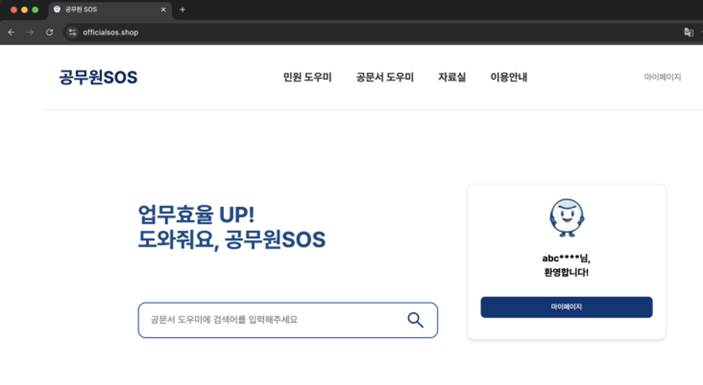
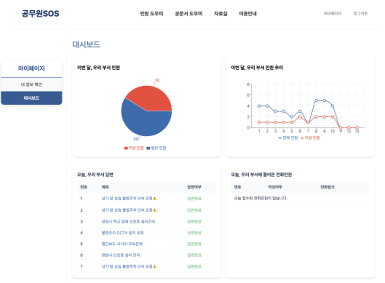

# 공무원 SOS (Frontend) | LLM을 이용한 공무원 업무 Al assistant

> KT Aivle School 부트캠프 팀 프로젝트  
> 👉 본 레포는 **프론트엔드 전담 구현 결과물**을 정리한 저장소입니다.  
> 🔗 관련 링크 | 전체 프로젝트에 대한 저장소 : https://github.com/Drawjustin/KT_BIG_PROJECT

---

## 📌 프로젝트 개요

국민신문고 민원 데이터를 기반으로  
(민원 데이터 연동을 위해 국민신문고 사이트를 구현하여, 해당 민원 접수 사이트 민원이 행정업무 AI 어시스턴트에 자동으로 분류되어 들어가도록 구현함)  
AI 모델을 통해 민원 부서를 분류하여 할당하고 악성 민원을 탐지하며,  
관리자에게 적절한 답변을 추천하는 민원 응답 자동화 서비스입니다.

또한, 실제 공무원이 참고할 수 있도록  
**공문서 내용 검색 및 유사 공문 추천 기능**을 포함하여  
**공공기관 행정 업무 효율화**를 목표로 한 실전형 시스템입니다.

👉 프론트엔드 전담 (100%) 구현

---

## 📄 주요 화면 및 역할

### 1️⃣ 로그인 / 회원가입 페이지
- JWT + 쿠키 기반 인증 구현
- Axios 기반 로그인 API 연동 및 예외처리
- 토큰 기반 사용자 상태 관리 (Redux)

### 2️⃣ 민원 답변 페이지
- 민원 리스트 조회 (검색 / 필터링)
- 민원 상세 내용 보기 (AI 민원내용 요약, 악성 여부 표시)
- AI 응답 추천 결과 표시 (LLM RAG 기반, Open AI)
- 추천된 응답 직접 수정 가능

### 3️⃣ 공문서 검색 페이지
- 키워드 기반 공문서 검색 기능 
- 공문서 요약 및 예상 질문과 답변 제공
- 유사 공문서 자동 추천 (백엔드 모델 연동)

### 4️⃣ 민원 대시보드 (관리자 페이지)
- 부서 민원 처리 현황 시각화
- 악성 민원 비율 파이차트 및 그래프 구성

### 5️⃣ 자료실 (사내 참조 문서 공간)
- 업무 참고용 문서 모아보기, 문서 다운로드
---

## 🧑‍💻 Frontend 사용 기술 

    
  
  
  

| 항목 | 기술 |
|------|------|
| Language | JavaScript (ES6+) |
| UI Library | React |
| Build Tool | Vite |
| State Management | Redux Toolkit |
| Styling | Styled-components |
| API | Axios (RESTful API) |
| Routing | React Router |
| Auth | JWT + Cookies |
| 협업 | GitHub, Notion, Figma |
| 배포 | AWS S3 + CloudFront |

## 👨‍💻 역할 및 기여도 (Frontend 100%)

| 기능 | 설명 |
|------|------|
| 로그인 인증 | JWT + 쿠키 인증 흐름 설계 및 구현  
| 민원 목록 | API 연동 → 리스트 조회 + 검색/정렬/필터 기능 구현  
| AI 응답 결과 | API 응답 기반 민원 추천 결과 UI 설계  
| 관리자 화면 | 대시보드 페이지 설계 및 시각화  
| 디자인 적용 | Figma 기반 스타일링 + 반응형 대응  

---

## 🖼 주요 화면

### 📷 메인 페이지

### 📷 마이페이지 (관리자 대시보드)

---

## 프로젝트 실행하기

### 사전 요구사항 
- Node.js : v23.5.0
- npm : 10.9.2

### 의존성 설치
- npm install

### 개발 서버 실행
- npm run dev

### 빌드
- npm run build

